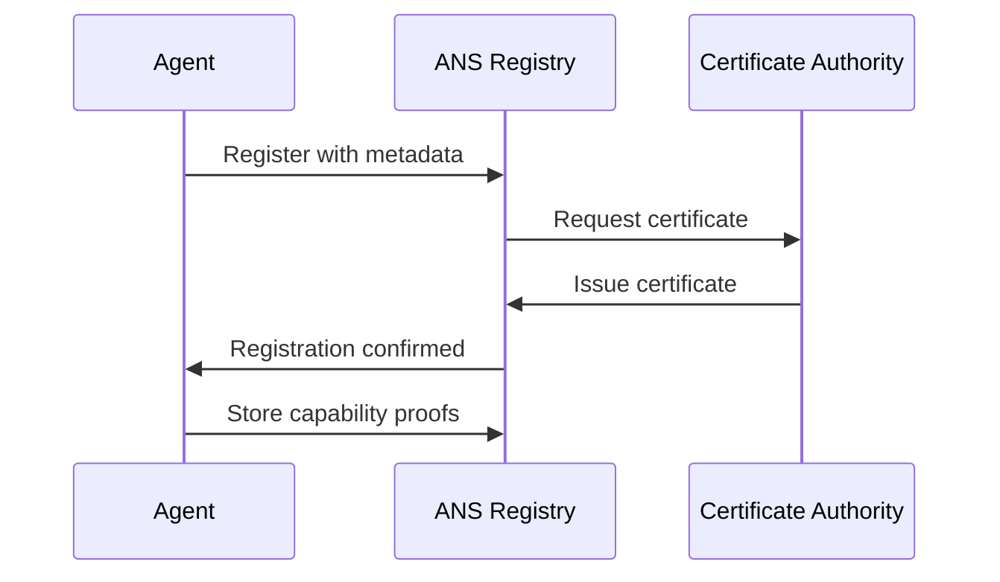
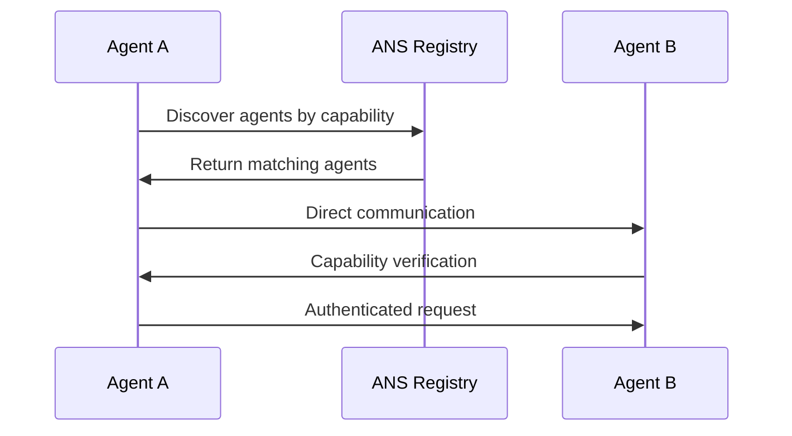
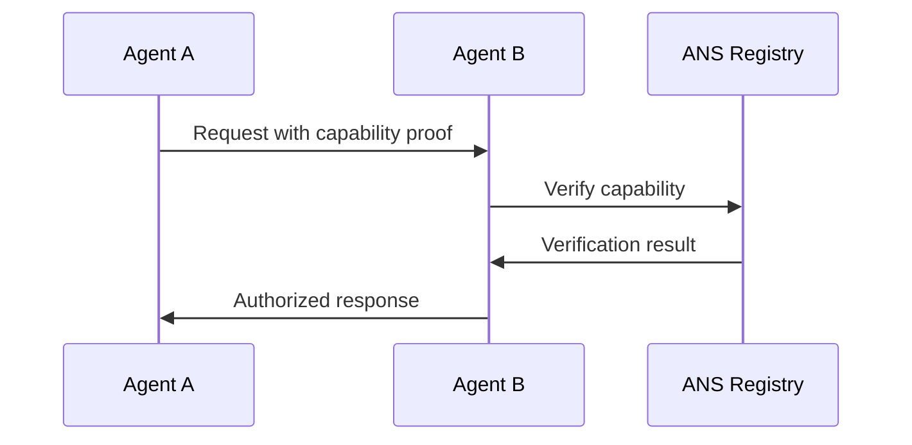
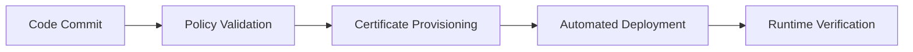

# ANS Architecture Documentation

## Overview

The Agent Name Service (ANS) provides a DNS-like trust layer for secure, scalable AI agent deployments on Kubernetes. This document describes the system architecture, components, and interactions.

## System Architecture

```
┌─────────────────────────────────────────────────────────────────┐
│                        ANS Architecture                         │
├─────────────────────────────────────────────────────────────────┤
│  ┌─────────────┐  ┌─────────────┐  ┌─────────────┐             │
│  │   Agent A   │  │   Agent B   │  │   Agent C   │             │
│  │             │  │             │  │             │             │
│  └─────────────┘  └─────────────┘  └─────────────┘             │
│         │                 │                 │                  │
│         └─────────────────┼─────────────────┘                  │
│                           │                                    │
│  ┌─────────────────────────────────────────────────────────────┤
│  │                ANS Registry                                 │
│  │  ┌─────────────┐  ┌─────────────┐  ┌─────────────┐         │
│  │  │   Agent     │  │ Certificate │  │   Policy    │         │
│  │  │ Discovery   │  │ Management  │  │ Enforcement │         │
│  │  └─────────────┘  └─────────────┘  └─────────────┘         │
│  └─────────────────────────────────────────────────────────────┤
│                           │                                    │
│  ┌─────────────────────────────────────────────────────────────┤
│  │              Kubernetes Infrastructure                      │
│  │  ┌─────────────┐  ┌─────────────┐  ┌─────────────┐         │
│  │  │   OPA       │  │   Service   │  │ Monitoring  │         │
│  │  │ Gatekeeper  │  │   Mesh      │  │   Stack     │         │
│  │  └─────────────┘  └─────────────┘  └─────────────┘         │
│  └─────────────────────────────────────────────────────────────┤
└─────────────────────────────────────────────────────────────────┘
```

## Core Components

### 1. ANS Registry

The ANS Registry is the central component that manages agent discovery, authentication, and capability verification.

**Responsibilities:**
- Agent registration and discovery
- Certificate management and validation
- Capability attestation
- Policy enforcement
- Audit logging

**Key Features:**
- RESTful API for agent operations
- Cryptographic identity management
- Zero-knowledge capability proofs
- Multi-protocol support (A2A, MCP, ACP)

### 2. Agent Naming Service (ANS) Client

The ANS Client library provides agents with the ability to register, discover, and communicate with other agents.

**Key Features:**
- ANS name parsing and generation
- Agent registration and discovery
- Capability verification
- Cryptographic operations
- Event-driven architecture

### 3. Kubernetes Integration

ANS integrates deeply with Kubernetes to provide native deployment and management capabilities.

**Components:**
- Custom Resource Definitions (CRDs)
- Admission Controllers
- Service Mesh Integration
- RBAC and Security Policies

### 4. Policy Engine (OPA Gatekeeper)

Open Policy Agent (OPA) Gatekeeper provides policy-as-code enforcement for agent deployments.

**Policy Categories:**
- Agent deployment policies
- Security policies
- Compliance policies (HIPAA, SOC2, etc.)
- Resource management policies

### 5. Monitoring and Observability

Comprehensive monitoring stack for agent operations and system health.

**Components:**
- Prometheus for metrics collection
- Grafana for visualization
- Jaeger for distributed tracing
- ELK stack for log aggregation

## ANS Naming Convention

### Format
```
Protocol://AgentID.Capability.Provider.v[Version].Extension
```

### Examples
```
a2a://concept-drift-detector.concept-drift-detection.research-lab.v2.1.prod
mcp://model-retrainer.model-training.mlops-team.v1.0.staging
acp://security-scanner.security-scanning.devsecops-team.v3.2.hipaa
```

### Components
- **Protocol**: Communication protocol (a2a, mcp, acp, custom)
- **AgentID**: Unique agent identifier
- **Capability**: Primary capability of the agent
- **Provider**: Organization or team providing the agent
- **Version**: Semantic version of the agent
- **Extension**: Environment or compliance context

## Security Model

### 1. Cryptographic Identity

**Components:**
- Decentralized Identifiers (DIDs)
- Verifiable Credentials (VCs)
- Certificate Authority (CA) hierarchy
- Public Key Infrastructure (PKI)

### 2. Capability Attestation

**Zero-Knowledge Proofs:**
- Agents prove capabilities without revealing implementation details
- Cryptographic verification of permissions
- Privacy-preserving capability verification

### 3. Trust Chain

```
Root CA → Intermediate CA → Agent Certificate → Capability Proof
```

### 4. Policy Enforcement

**Layers:**
- Admission control at deployment time
- Runtime policy enforcement
- Network-level security policies
- Application-level access control

## Communication Flow

### 1. Agent Registration



### 2. Agent Discovery



### 3. Capability Verification



## Deployment Architecture

### 1. Namespace Structure

```
ans-system/          # ANS infrastructure
├── ans-registry     # Core registry service
├── opa-gatekeeper   # Policy enforcement
└── monitoring       # Observability stack

default/             # Demo agents
├── concept-drift-detector
├── model-retrainer
└── notification-agent
```

### 2. Service Mesh Integration

**Istio Configuration:**
- mTLS between services
- Traffic management
- Security policies
- Observability

### 3. GitOps Workflow



## Performance Characteristics

### 1. Latency Metrics

- **Agent Registration**: < 100ms
- **Agent Discovery**: < 50ms
- **Capability Verification**: < 200ms
- **Policy Evaluation**: < 10ms

### 2. Scalability

- **Agent Capacity**: 10,000+ concurrent agents
- **Request Throughput**: 100,000+ requests/second
- **Geographic Distribution**: Multi-region support

### 3. Availability

- **Uptime**: 99.9% availability
- **Recovery Time**: < 30 seconds
- **Data Durability**: 99.999999999% (11 9's)

## Security Considerations

### 1. Threat Model

**Threats:**
- Agent impersonation
- Capability escalation
- Data exfiltration
- Denial of service

**Mitigations:**
- Cryptographic authentication
- Capability-based access control
- Network segmentation
- Rate limiting and circuit breakers

### 2. Compliance

**Standards:**
- HIPAA (Healthcare)
- SOC 2 (Security)
- PCI DSS (Payment)
- GDPR (Privacy)

### 3. Audit and Logging

**Requirements:**
- Complete audit trail
- Immutable logs
- Real-time monitoring
- Compliance reporting

## Future Enhancements

### 1. Planned Features

- **Federated ANS**: Multi-cluster support
- **AI-Powered Policies**: Machine learning-based policy generation
- **Edge Computing**: Edge agent deployment
- **Quantum-Safe Cryptography**: Post-quantum security

### 2. Integration Roadmap

- **Cloud Providers**: AWS, Azure, GCP native integration
- **ML Platforms**: Kubeflow, MLflow, Weights & Biases
- **Security Tools**: Falco, OPA, Trivy integration
- **Monitoring**: Datadog, New Relic, Splunk integration

## Troubleshooting

### Common Issues

1. **Agent Registration Failures**
   - Check certificate validity
   - Verify network connectivity
   - Validate ANS name format

2. **Discovery Issues**
   - Confirm agent is registered
   - Check capability matching
   - Verify provider authorization

3. **Policy Violations**
   - Review OPA policies
   - Check agent metadata
   - Validate security requirements

### Debug Commands

```bash
# Check agent registration
kubectl get agents -n ans-system

# View policy violations
kubectl get events --field-selector reason=PolicyViolation

# Check certificate status
kubectl get certificates -n ans-system

# View audit logs
kubectl logs -n ans-system deployment/ans-registry
```

## References

- [ANS Specification](ans-specification.md)
- [API Reference](api-reference.md)
- [Security Guide](security-guide.md)
- [Deployment Guide](deployment-guide.md)
